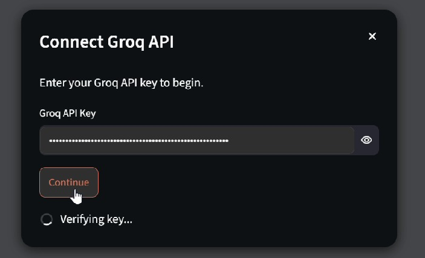
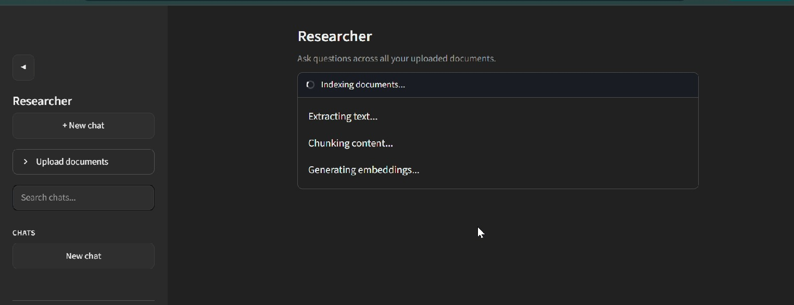
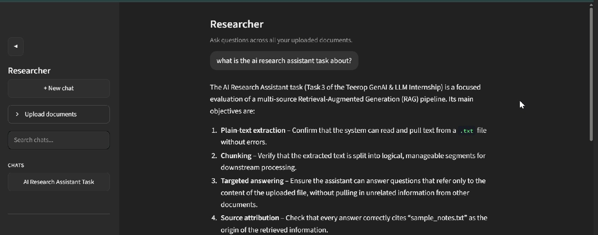
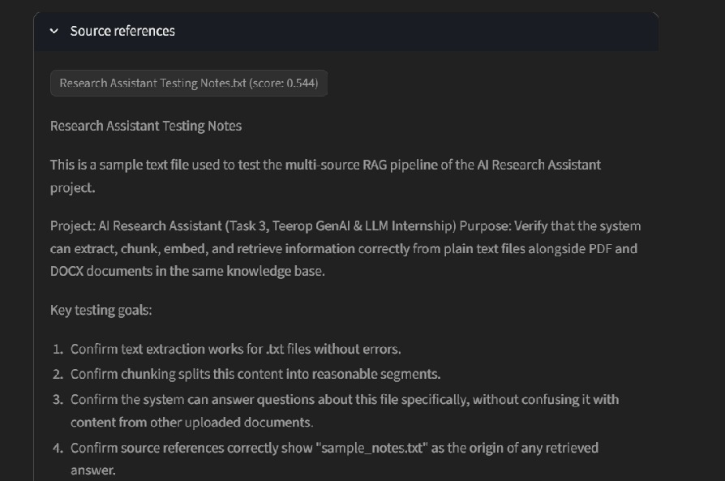
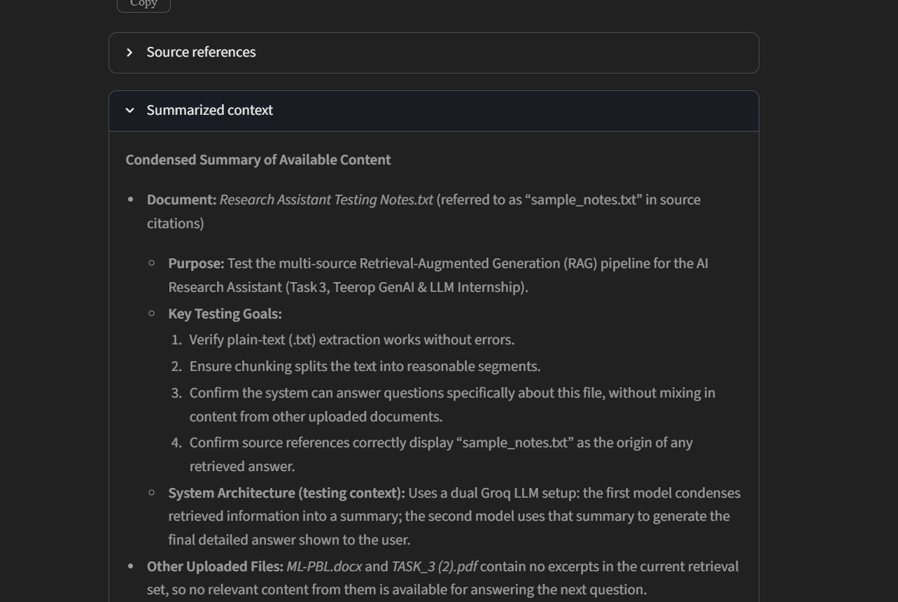
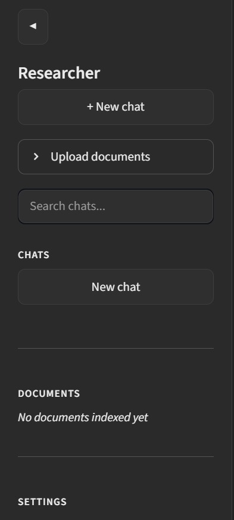
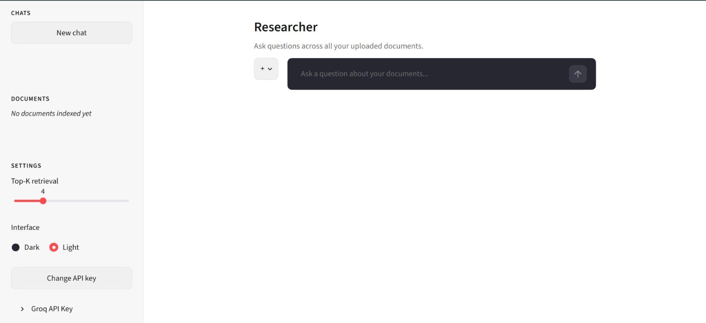
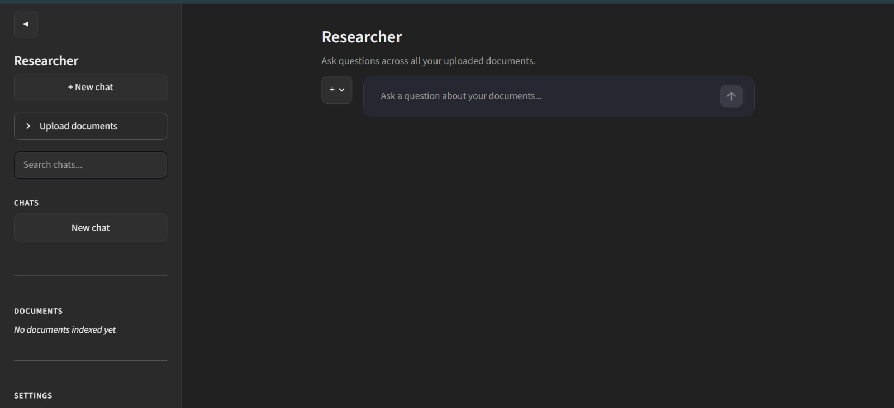

# AI Research Assistant — Multi-Source RAG

A Streamlit-based research assistant that answers questions across multiple uploaded documents (PDF, DOCX, TXT) using a Retrieval-Augmented Generation (RAG) pipeline combined with a dual Groq LLM workflow.

Built for the **Teerop (SMC-Private) Limited — Gen AI & LLM Applications Internship, Task 03**.

---

## Demo Video

📺 **Watch the full demo:** https://youtu.be/zxWizrBk7C4

---

## Features

- **Multi-document upload** — PDF, DOCX, and TXT files, processed together into a single unified knowledge base
- **Automatic text extraction** — PyMuPDF (PDF), python-docx (DOCX), native Python (TXT), with metadata (source filename, page number) preserved for citations
- **Intelligent chunking** — LangChain's `RecursiveCharacterTextSplitter` (1000 characters, 150 overlap)
- **Semantic embeddings** — Sentence Transformers, `all-MiniLM-L6-v2`
- **FAISS vector database** — fast similarity search with a minimum score threshold to filter out weakly-relevant chunks
- **Source-aware retrieval** — when a question's wording clearly points to a specific uploaded file, retrieval is scoped to that file rather than pulling from all documents indiscriminately
- **Dual Groq LLM architecture** (see below)
- **Conversation memory** — maintained per chat session, so follow-up questions work naturally
- **Source references & citations** — every answer includes expandable, page-numbered excerpts from the original documents
- **Expandable summarized context** — see exactly what Model 1 passed to Model 2
- **Real-time processing indicators** — staged status for both document indexing and question answering
- **Multiple chat sessions** — auto-titled by the LLM, searchable from the sidebar
- **Light/dark theme toggle**
- **Comprehensive error handling** (see below)

---

## Dual Groq Model Architecture

| Role | Model | Purpose |
|---|---|---|
| Context Summarizer | `openai/gpt-oss-120b` | Condenses retrieved chunks + conversation history into a compact, factual summary |
| Final Answer Generator | `openai/gpt-oss-20b` | Produces the final, structured, cited answer from the summarized context |

> **Note on model choice:** the original task specification named Mixtral 8x7B and Llama 3.1 8B Instant. Both have since been deprecated by Groq. `openai/gpt-oss-120b` and `openai/gpt-oss-20b` are Groq's official recommended replacements, and fill the same two architectural roles (summarizer and answer generator) as originally specified.

---

## Tech Stack

| Technology | Purpose |
|---|---|
| Python | Backend |
| Streamlit | Web interface |
| Groq API | Dual LLM architecture |
| langchain-text-splitters | Document chunking |
| PyMuPDF | PDF parsing |
| python-docx | DOCX parsing |
| Sentence Transformers | Embedding generation |
| FAISS | Vector database |

---

## Setup

1. Clone the repository and navigate into the project folder.
2. Create and activate a virtual environment:
```bash
   python -m venv venv
   venv\Scripts\activate      # Windows
   source venv/bin/activate   # macOS/Linux
```
3. Install dependencies:
```bash
   pip install -r requirements.txt
```
4. Get a free API key from [console.groq.com](https://console.groq.com).
5. Run the app:
```bash
   streamlit run app.py
```
6. Enter your Groq API key when prompted — it's validated before you can proceed.

---

## Application Workflow

1. Upload documents (PDF / DOCX / TXT)
2. Text is extracted and validated (format, size, empty-file checks)
3. Documents are chunked (RecursiveCharacterTextSplitter)
4. Chunks are embedded (all-MiniLM-L6-v2) and stored in FAISS
5. User asks a question
6. Relevant chunks are retrieved (scoped to a specific file if the question implies one)
7. Model 1 (gpt-oss-120b) summarizes the retrieved context + conversation history
8. Model 2 (gpt-oss-20b) generates the final answer with source references

---

## Project Structure

```
teerop_3/
├── app.py                       # Streamlit UI, session state, chat/upload orchestration
├── requirements.txt
├── .streamlit/
│   └── config.toml              # Theme configuration
├── utils/
│   ├── document_processor.py    # PDF/DOCX/TXT extraction + validation
│   ├── chunking.py              # RecursiveCharacterTextSplitter wrapper
│   ├── embeddings.py            # Sentence Transformers embedding generation
│   ├── vector_store.py          # FAISS index, standard + filtered search
│   ├── memory.py                # Per-chat conversation memory
│   └── llm_handler.py           # Dual Groq LLM orchestration
├── data/
│   └── sample_docs/             # Sample PDF/DOCX/TXT for testing
└── screenshots/                 # UI screenshots (see below)
```

## Screenshots

### API Key Verification
Blocking modal that validates the Groq API key before allowing entry into the app.



### Document Upload & Indexing
Multi-format upload with real-time staged status: extracting, chunking, embedding, and building the FAISS index.



### Chat Interface
Conversational interface showing a question and its generated answer.



### Source References
Expandable citations showing the exact document, page number, and excerpt used to generate the answer.



### Summarized Context
Expandable panel showing Model 1's condensed context, passed to Model 2 for the final answer.



### Sidebar — Expanded and Collapsed
Full sidebar with chats, documents, and settings; and the collapsed icon rail for a minimal view.




### Light and Dark Theme
Full theme toggle support across the entire interface.




---

## Error Handling

| Case | Behavior |
|---|---|
| Invalid document format | Rejected per-file with a clear message; other valid files in the same batch still process |
| Empty upload (0-byte file) | Rejected before processing, with a specific message |
| Invalid/expired Groq API key | Caught at the entry dialog and mid-conversation; app never crashes |
| Groq API failures (rate limit, server error) | Caught and shown as a readable in-chat message |
| Network interruptions | Surfaced as a connection error message, not a raw traceback |
| Missing Python dependencies | Caught at startup with an install instruction, instead of crashing |
| Question asked before any upload | Prompts the user to upload a document first |

---

## Known Limitations

This is an internship deliverable, not a production SaaS product. If extended for real deployment, it would need:

- **Persistence** — the FAISS index and chat history currently live only in memory and reset on every app restart; no database layer
- **Authentication** — single-user per session, no login/accounts
- **Rate limiting** — no protection against API abuse
- **Scanned/image-only PDFs** — text extraction only; scanned certificate-style pages with no text layer are out of scope for this task (handled separately in the Task 1 OCR project)
- **Cold start time** — the embedding model downloads and loads on first document upload, which takes longer on the very first run
